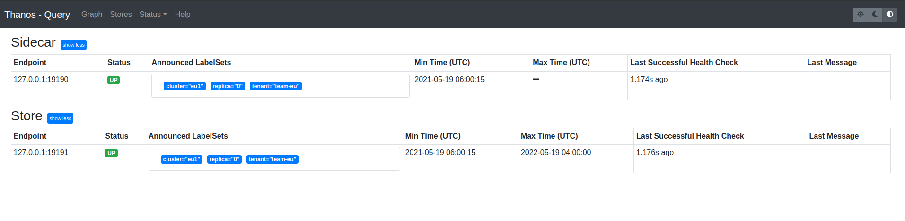
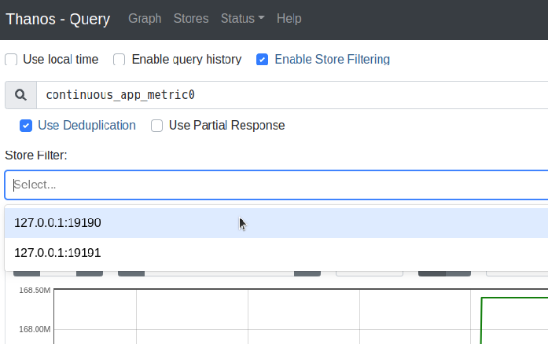

# Thanos Course

## Global View and seamless HA for Prometheus

Initial Setup Prometheus


Prepare persistent volumes

```bash
mkdir -p prometheus0_eu1_data prometheus0_us1_data prometheus1_us1_data
```

Deploying EU1

```bash
docker run -d --net=host --rm \
    -v $(pwd)/prometheus0_eu1.yml:/etc/prometheus/prometheus.yml \
    -v $(pwd)/prometheus0_eu1_data:/prometheus \
    -u root \
    --name prometheus-0-eu1 \
    quay.io/prometheus/prometheus:v2.14.0 \
    --config.file=/etc/prometheus/prometheus.yml \
    --storage.tsdb.path=/prometheus \
    --web.listen-address=:9090 \
    --web.external-url=https://167772172-9090-simba09b.environments.katacoda.com \
    --web.enable-lifecycle \
    --web.enable-admin-api && echo "Prometheus EU1 started!
```

Deploying US1

```bash
docker run -d --net=host --rm \
    -v $(pwd)/prometheus0_us1.yml:/etc/prometheus/prometheus.yml \
    -v $(pwd)/prometheus0_us1_data:/prometheus \
    -u root \
    --name prometheus-0-us1 \
    quay.io/prometheus/prometheus:v2.14.0 \
    --config.file=/etc/prometheus/prometheus.yml \
    --storage.tsdb.path=/prometheus \
    --web.listen-address=:9091 \
    --web.external-url=https://167772172-9091-simba09b.environments.katacoda.com \
    --web.enable-lifecycle \
    --web.enable-admin-api && echo "Prometheus 0 US1 started!
```

```bash
docker run -d --net=host --rm \
    -v $(pwd)/prometheus1_us1.yml:/etc/prometheus/prometheus.yml \
    -v $(pwd)/prometheus1_us1_data:/prometheus \
    -u root \
    --name prometheus-1-us1 \
    quay.io/prometheus/prometheus:v2.14.0 \
    --config.file=/etc/prometheus/prometheus.yml \
    --storage.tsdb.path=/prometheus \
    --web.listen-address=:9092 \
    --web.external-url=https://167772172-9092-simba09b.environments.katacoda.com \
    --web.enable-lifecycle \
    --web.enable-admin-api && echo "Prometheus 1 US1 started!"
```

* https://167772172-9090-simba09b.environments.katacoda.com/graph
* https://167772172-9091-simba09b.environments.katacoda.com/graph
* https://167772172-9092-simba09b.environments.katacoda.com/graph

### Thanos Sidecars

View Thanos Components

```bash
docker run --rm quay.io/thanos/thanos:v0.26.0 --help
```

Installation


Adding sidecar to EU1 Prometheus

```bash
docker run -d --net=host --rm \
    -v $(pwd)/prometheus0_eu1.yml:/etc/prometheus/prometheus.yml \
    --name prometheus-0-sidecar-eu1 \
    -u root \
    quay.io/thanos/thanos:v0.26.0 \
    sidecar \
    --http-address 0.0.0.0:19090 \
    --grpc-address 0.0.0.0:19190 \
    --reloader.config-file /etc/prometheus/prometheus.yml \
    --prometheus.url http://127.0.0.1:9090 && echo "Started sidecar for Prometheus 0 EU1"
```

Adding sidecars to each replica of Prometheus in US1

```bash
docker run -d --net=host --rm \
    -v $(pwd)/prometheus0_us1.yml:/etc/prometheus/prometheus.yml \
    --name prometheus-0-sidecar-us1 \
    -u root \
    quay.io/thanos/thanos:v0.26.0 \
    sidecar \
    --http-address 0.0.0.0:19091 \
    --grpc-address 0.0.0.0:19191 \
    --reloader.config-file /etc/prometheus/prometheus.yml \
    --prometheus.url http://127.0.0.1:9091 && echo "Started sidecar for Prometheus 0 US1"
```

```bash
docker run -d --net=host --rm \
    -v $(pwd)/prometheus1_us1.yml:/etc/prometheus/prometheus.yml \
    --name prometheus-1-sidecar-us1 \
    -u root \
    quay.io/thanos/thanos:v0.26.0 \
    sidecar \
    --http-address 0.0.0.0:19092 \
    --grpc-address 0.0.0.0:19192 \
    --reloader.config-file /etc/prometheus/prometheus.yml \
    --prometheus.url http://127.0.0.1:9092 && echo "Started sidecar for Prometheus 1 US1"
```

### Thanos Querier


Deploying Thanos Querier

```bash
docker run -d --net=host --rm \
    --name querier \
    quay.io/thanos/thanos:v0.26.0 \
    query \
    --http-address 0.0.0.0:29090 \
    --query.replica-label replica \
    --store 127.0.0.1:19190 \
    --store 127.0.0.1:19191 \
    --store 127.0.0.1:19192 && echo "Started Thanos Querier"
```

## Downsampling and unlimited metric retention for Prometheus

### Generate Artificial Metrics for 1 year

```bash
mkdir -p /root/prom-eu1 && docker run -i quay.io/thanos/thanosbench:v0.2.0-rc.1 block plan -p continuous-365d-tiny --labels 'cluster="eu1"' --max-time=6h | docker run -v /root/prom-eu1:/prom-eu1 -i quay.io/thanos/thanosbench:v0.2.0-rc.1 block gen --output.dir prom-eu1
```

see dozens of generated TSDB blocks:

```bash
ls -lR /root/prom-eu1
```

### Starting Prometheus Instance

Note -v /root/prom-eu1:/prometheus \ and --storage.tsdb.path=/prometheus that allows us to place our generated data in Prometheus data directory.

Let's deploy Prometheus now. Note that we disabled local Prometheus compactions storage.tsdb.max-block-duration and min flags. Currently, this is important for the basic object storage backup scenario to avoid conflicts between the bucket and local compactions. Read more here.

We also extend Prometheus retention: --storage.tsdb.retention.time=1000d. This is because Prometheus by default removes all data older than 2 weeks. And we have a year

#### Deploying EU1

```bash
docker run -d --net=host --rm \
    -v /root/editor/prometheus0_eu1.yml:/etc/prometheus/prometheus.yml \
    -v /root/prom-eu1:/prometheus \
    -u root \
    --name prometheus-0-eu1 \
    quay.io/prometheus/prometheus:v2.20.0 \
    --config.file=/etc/prometheus/prometheus.yml \
    --storage.tsdb.retention.time=1000d \
    --storage.tsdb.path=/prometheus \
    --storage.tsdb.max-block-duration=2h \
    --storage.tsdb.min-block-duration=2h \
    --web.listen-address=:9090 \
    --web.external-url=https://167772184-9090-cykoria04.environments.katacoda.com \
    --web.enable-lifecycle \
    --web.enable-admin-api
```

Setup verification

https://167772177-9090-elsy04.environments.katacoda.com/graph?g0.range_input=1y&g0.expr=continuous_app_metric0&g0.tab=0

Thanos Sidecar & Querier

```bash
docker run -d --net=host --rm \
    --name prometheus-0-eu1-sidecar \
    -u root \
    quay.io/thanos/thanos:v0.26.0 \
    sidecar \
    --http-address 0.0.0.0:19090 \
    --grpc-address 0.0.0.0:19190 \
    --prometheus.url http://127.0.0.1:9090
```

```bash
docker run -d --net=host --rm \
    --name querier \
    quay.io/thanos/thanos:v0.26.0 \
    query \
    --http-address 0.0.0.0:9091 \
    --query.replica-label replica \
    --store 127.0.0.1:19190
```

Setup verification

https://167772177-9091-elsy04.environments.katacoda.com/stores

### Thanos Sidecars

Starting Object Storage: Minio

simple S3-compatible Minio engine that keeps data in local disk:

```bash
mkdir /root/minio && \
docker run -d --rm --name minio \
     -v /root/minio:/data \
     -p 9000:9000 -e "MINIO_ACCESS_KEY=minio" -e "MINIO_SECRET_KEY=melovethanos" \
     minio/minio:RELEASE.2019-01-31T00-31-19Z \
     server /data
```

Create thanos bucket:

```bash
mkdir /root/minio/thanos
```

Verification

Access Key = minio Secret Key = melovethanos

https://www.katacoda.com/thanos/courses/thanos/2-lts#:~:text=open%20Minio%20server%20UI

Sidecar block backup

restart sidecar with updated configuration in backup mode.

```bash
docker stop prometheus-0-eu1-sidecar
```

run sidecar:

```bash
docker run -d --net=host --rm \
    -v /root/editor/bucket_storage.yaml:/etc/thanos/minio-bucket.yaml \
    -v /root/prom-eu1:/prometheus \
    --name prometheus-0-eu1-sidecar \
    -u root \
    quay.io/thanos/thanos:v0.26.0 \
    sidecar \
    --tsdb.path /prometheus \
    --objstore.config-file /etc/thanos/minio-bucket.yaml \
    --shipper.upload-compacted \
    --http-address 0.0.0.0:19090 \
    --grpc-address 0.0.0.0:19190 \
    --prometheus.url http://127.0.0.1:9090
```

Verification

https://167772177-9000-elsy04.environments.katacoda.com/minio/

### Thanos Store Gateway

Deploying store for EU1 Prometheus data

```bash
docker run -d --net=host --rm \
    -v /root/editor/bucket_storage.yaml:/etc/thanos/minio-bucket.yaml \
    --name store-gateway \
    quay.io/thanos/thanos:v0.26.0 \
    store \
    --objstore.config-file /etc/thanos/minio-bucket.yaml \
    --http-address 0.0.0.0:19091 \
    --grpc-address 0.0.0.0:19191
```

Store Gateway gRPC address --store 127.0.0.1:19191 to Querier

```bash
docker stop querier && \
docker run -d --net=host --rm \
   --name querier \
   quay.io/thanos/thanos:v0.26.0 \
   query \
   --http-address 0.0.0.0:9091 \
   --query.replica-label replica \
   --store 127.0.0.1:19190 \
   --store 127.0.0.1:19191
```

https://167772182-9091-ollie09.environments.katacoda.com/graph?g0.range_input=1y&g0.max_source_resolution=0s&g0.expr=continuous_app_metric0&g0.tab=0

View Stores



Enable Store Filtering



### Thanos Compactor

Deploying Thanos Compactor

```bash
docker run -d --net=host --rm \
 -v /root/editor/bucket_storage.yaml:/etc/thanos/minio-bucket.yaml \
    --name thanos-compact \
    quay.io/thanos/thanos:v0.26.0 \
    compact \
    --wait --wait-interval 30s \
    --consistency-delay 0s \
    --objstore.config-file /etc/thanos/minio-bucket.yaml \
    --http-address 0.0.0.0:19095
```

Setup Verification

To check if compactor works fine, we can look at the

https://167772182-19095-ollie09.environments.katacoda.com/loaded