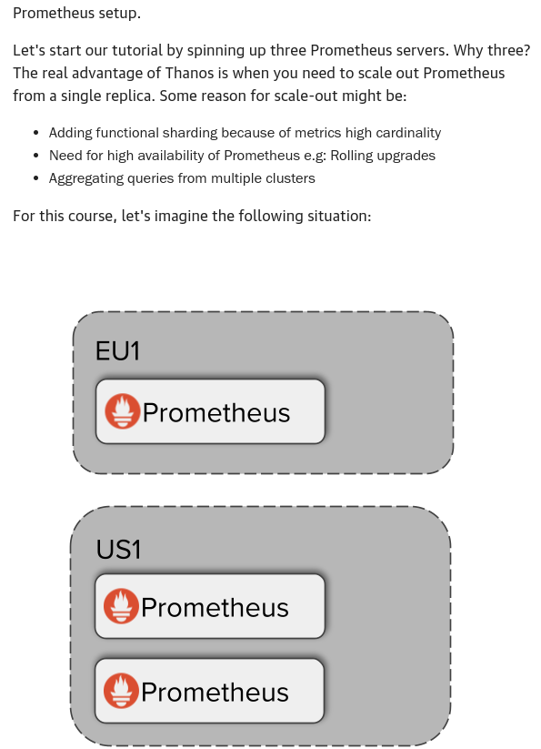
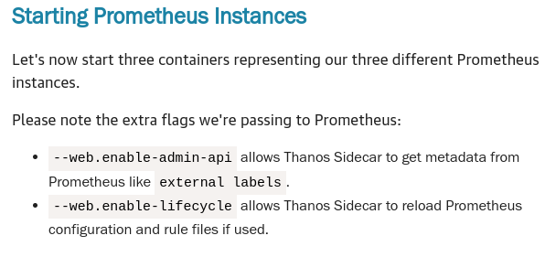
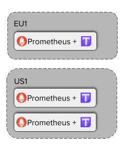
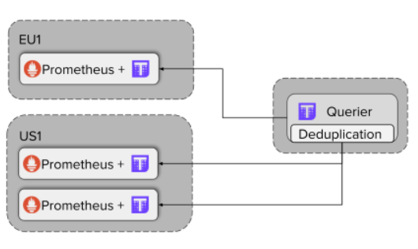

# Thanos Course

## Initial Setup Prometheus





Prepare persistent volumes

```bash
mkdir -p prometheus0_eu1_data prometheus0_us1_data prometheus1_us1_data
```

Deploying EU1

```bash
docker run -d --net=host --rm \
    -v $(pwd)/prometheus0_eu1.yml:/etc/prometheus/prometheus.yml \
    -v $(pwd)/prometheus0_eu1_data:/prometheus \
    -u root \
    --name prometheus-0-eu1 \
    quay.io/prometheus/prometheus:v2.14.0 \
    --config.file=/etc/prometheus/prometheus.yml \
    --storage.tsdb.path=/prometheus \
    --web.listen-address=:9090 \
    --web.external-url=https://167772172-9090-simba09b.environments.katacoda.com \
    --web.enable-lifecycle \
    --web.enable-admin-api && echo "Prometheus EU1 started!
```

Deploying US1

```bash
docker run -d --net=host --rm \
    -v $(pwd)/prometheus0_us1.yml:/etc/prometheus/prometheus.yml \
    -v $(pwd)/prometheus0_us1_data:/prometheus \
    -u root \
    --name prometheus-0-us1 \
    quay.io/prometheus/prometheus:v2.14.0 \
    --config.file=/etc/prometheus/prometheus.yml \
    --storage.tsdb.path=/prometheus \
    --web.listen-address=:9091 \
    --web.external-url=https://167772172-9091-simba09b.environments.katacoda.com \
    --web.enable-lifecycle \
    --web.enable-admin-api && echo "Prometheus 0 US1 started!
```

```bash
docker run -d --net=host --rm \
    -v $(pwd)/prometheus1_us1.yml:/etc/prometheus/prometheus.yml \
    -v $(pwd)/prometheus1_us1_data:/prometheus \
    -u root \
    --name prometheus-1-us1 \
    quay.io/prometheus/prometheus:v2.14.0 \
    --config.file=/etc/prometheus/prometheus.yml \
    --storage.tsdb.path=/prometheus \
    --web.listen-address=:9092 \
    --web.external-url=https://167772172-9092-simba09b.environments.katacoda.com \
    --web.enable-lifecycle \
    --web.enable-admin-api && echo "Prometheus 1 US1 started!"
```

* https://167772172-9090-simba09b.environments.katacoda.com/graph
* https://167772172-9091-simba09b.environments.katacoda.com/graph
* https://167772172-9092-simba09b.environments.katacoda.com/graph

## Thanos Sidecars

View Thanos Components

```bash
docker run --rm quay.io/thanos/thanos:v0.26.0 --help
```

Installation



Adding sidecar to EU1 Prometheus

```bash
docker run -d --net=host --rm \
    -v $(pwd)/prometheus0_eu1.yml:/etc/prometheus/prometheus.yml \
    --name prometheus-0-sidecar-eu1 \
    -u root \
    quay.io/thanos/thanos:v0.26.0 \
    sidecar \
    --http-address 0.0.0.0:19090 \
    --grpc-address 0.0.0.0:19190 \
    --reloader.config-file /etc/prometheus/prometheus.yml \
    --prometheus.url http://127.0.0.1:9090 && echo "Started sidecar for Prometheus 0 EU1"
```

Adding sidecars to each replica of Prometheus in US1

```bash
docker run -d --net=host --rm \
    -v $(pwd)/prometheus0_us1.yml:/etc/prometheus/prometheus.yml \
    --name prometheus-0-sidecar-us1 \
    -u root \
    quay.io/thanos/thanos:v0.26.0 \
    sidecar \
    --http-address 0.0.0.0:19091 \
    --grpc-address 0.0.0.0:19191 \
    --reloader.config-file /etc/prometheus/prometheus.yml \
    --prometheus.url http://127.0.0.1:9091 && echo "Started sidecar for Prometheus 0 US1"
```

```bash
docker run -d --net=host --rm \
    -v $(pwd)/prometheus1_us1.yml:/etc/prometheus/prometheus.yml \
    --name prometheus-1-sidecar-us1 \
    -u root \
    quay.io/thanos/thanos:v0.26.0 \
    sidecar \
    --http-address 0.0.0.0:19092 \
    --grpc-address 0.0.0.0:19192 \
    --reloader.config-file /etc/prometheus/prometheus.yml \
    --prometheus.url http://127.0.0.1:9092 && echo "Started sidecar for Prometheus 1 US1"
```

## Thanos Querier



Deploying Thanos Querier

```bash
docker run -d --net=host --rm \
    --name querier \
    quay.io/thanos/thanos:v0.26.0 \
    query \
    --http-address 0.0.0.0:29090 \
    --query.replica-label replica \
    --store 127.0.0.1:19190 \
    --store 127.0.0.1:19191 \
    --store 127.0.0.1:19192 && echo "Started Thanos Querier"
```